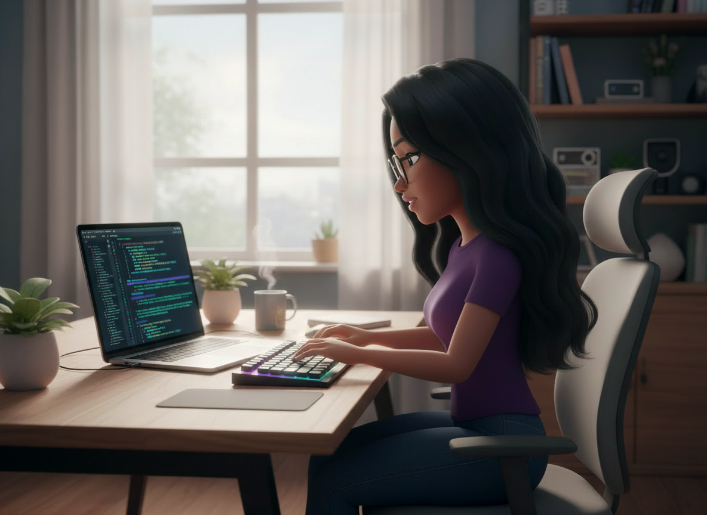

<h2 align="center">hi there ✨</h2>

     

fullstack developer building thoughtful web experiences 🌸

---

### 💻 tech i enjoy

  
  
  

---

### ⚡ interests

🧠 ethical ai  
🛠 developer experience  
📊 experimentation & product systems  

---

### 📚 deepening understanding of

☁️ cloud architecture  
🔁 improving feedback loops between users, data, and engineering decisions  
 
---

### 🌿 outside of coding

🏔 outdoors  
✈️ travel   
✍️ calligraphy 

---
